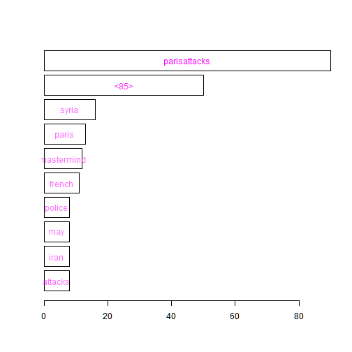
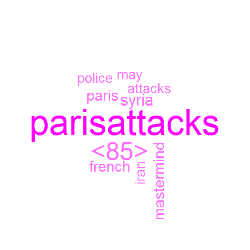
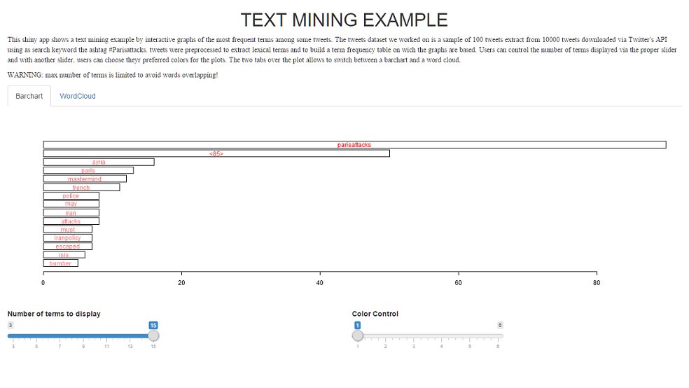

## SCOPE

Scope of the Shiny App developed is to perform some interactive text mining on tweets.

The text mining will be show under the form of an histogram and a wordcloud infographic of the most frequent words among tweets.   

--- .class #id 

## DATASET

The [raw dataset](https://github.com/dtiana/SHINYAPP/blob/master/III_World_War.xlsx) is a corpus of 10000 tweets downloaded via Twitter's API using as search keyword the ashtag #Parisattacks.
To reduce computational time we worked on a [random sample subset](https://github.com/dtiana/SHINYAPP/blob/master/sample_tweets.xlsx) of 100 tweets.

Tweets were preprocessed remove extra whitespaces, punctuation, url's, stopwords and so on.
Then the words in tweets text were stemmed and the final tidy corpus saved as a ["tm"](https://cran.r-project.org/web/packages/tm/index.html) corpus(available [here](https://github.com/dtiana/SHINYAPP/tree/master/mycorpus)).

The following code loads the tidy corpus and builds a term frequency table.

```r
library(twitteR); library(tm); library(xlsx); library(wordcloud); library(IDPmisc)
myCorpus <- VCorpus(DirSource("mycorpus", encoding = "UTF-8"))
myCorpus <- tm_map(myCorpus, PlainTextDocument)
myTdm <- TermDocumentMatrix(myCorpus, control=list(wordLengths=c(3,Inf)))
m <- as.matrix(myTdm); wordFreq <- sort(rowSums(m), decreasing=T)
```

--- .class #id

## HISTOGRAM

To show the words importance among tweets the first graph chosen is an histogram based on the term frequency table in this way showing even the values of the frequencies.
Down here a NON interactive example of the graph for the first 10 most frequent terms.
 


--- .class #id

## WORDCLOUD
Just to practice with infographic, the secong graph chosen is a wordcloud.
Again, the plot shows a NON interactive example on the first 10 most frequent terms.
 


--- .class #id

## THE SHINY APP

Interactivity in the shiny app is performed by two slider selectors to set how many terms showing and the color of the plot. The figure below shows the histogram plot while the wordcloud is accessible via tabs.



--- .class #id
